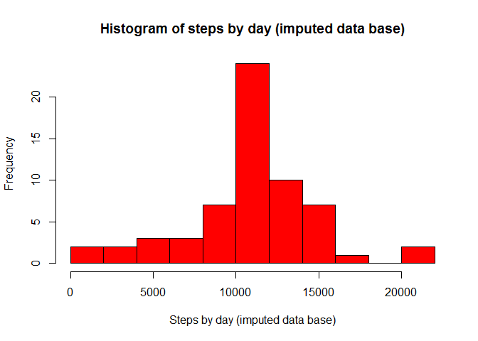

# Reproducible Research: Peer Assessment 1


## Loading and preprocessing the data


Loading the data:

```r
setwd("C:/Users/David/Desktop/Coursera/5 Reproducible research/w2 assignment")
act <- read.csv("activity.csv")
str(act)
```

Setting 'date' variable as class Date:

```r
act$date <- as.Date(as.character(act$date))
class(act$date)
```

Making a data frame without NA:

```r
actNA <- is.na(act$steps)
actClean <- act[!actNA, ]
str(actClean)
head(actClean, 20)
```


## What is mean total number of steps taken per day?


Calculating the total number of steps taken per day, and fixing labels:

```r
actDay <- aggregate(act$steps, by = list(act$date), sum)
head(actDay)
names(actDay)[1] = "date"
names(actDay)[2] = "steps"
str(actDay)
```

Making a histogram of the total number of steps taken each day:

```r
hist(actDay$steps, main = "Histogram of steps by day", xlab = "Steps by day",
     col = "grey", breaks = 9)
```

<!-- -->

Mean and median of the total number of steps taken per day:

```r
mean(actDay$steps, na.rm = T)
```

```
## [1] 10766.19
```

```r
median(actDay$steps, na.rm = T)
```

```
## [1] 10765
```


## What is the average daily activity pattern?


Calculating the average number of steps per interval, and fixing labels:

```r
actInterval <- aggregate(actClean$steps, by = list(actClean$interval), mean)
head(actInterval)
names(actInterval)[1] = "interval"
names(actInterval)[2] = "avgSteps"
str(actInterval)
```

Making a time series plot of avg steps by interval:

```r
plot.ts(actInterval$avgSteps,
        main = "Average number of steps by 5-minute interval",
        xlab = "intervals (5 minute)", ylab = "Average number of steps",
        col = "blue")
```

<!-- -->

Identifying which 5-minute interval contains the maximum number of steps:

```r
which.max(actInterval$avgSteps)
```

```
## [1] 104
```

```r
max(actInterval$avgSteps)
```

```
## [1] 206.1698
```


## Imputing missing values


Total number of NAs in the dataset:

```r
sum(actNA)
```

```
## [1] 2304
```

Imputation method will be based on mean value for the given interval.

Creating a new dataset, but with the missing data filled in:

```r
actNew <- act
temp <- 0
for (i in 1:length(actNew$steps)) {
        if (is.na(actNew$steps[i]) == T) {
                temp <- actNew$interval[i]
                rowID <- which(actInterval$interval == temp)
                actNew$steps[i] <- actInterval$avgSteps[rowID]
        }
}
```

Calculating the total number of steps taken per day in the new data base, and fixing labels:

```r
actNewDay <- aggregate(actNew$steps, by = list(actNew$date), sum)
head(actNewDay)
names(actNewDay)[1] = "date"
names(actNewDay)[2] = "steps"
str(actNewDay)
```

Making a histogram of the total number of steps taken each day in the new DB:

```r
hist(actNewDay$steps, main = "Histogram of steps by day (imputed data base)",
     xlab = "Steps by day (imputed data base)",
     col = "red", breaks = 9)
```

<!-- -->

Mean and median of the total number of steps taken per day (imptued DB):

```r
mean(actNewDay$steps)
```

```
## [1] 10766.19
```

```r
median(actNewDay$steps)
```

```
## [1] 10766.19
```
We can notice that, while mean remained the same, new median is 1,19 higher


## Are there differences in activity patterns between weekdays and weekends?


Creating a new factor variable to diferentiate weekdays from weekends:

```r
actNew$day <- weekdays(actNew$date)
actNew$weekend <- ifelse(actNew$day == "Saturday" | actNew$day == "Sunday",
                         "Weekend", "Weekday")
head(actNew)
```

Making a time series panel plot of 5-minute interval (x-axis) and average number
of steps taken, averaged across all weekday days or weekend days (y-axis):

```r
actNewWeekend <- aggregate(actNew$steps,
                           by = list(actNew$weekend, actNew$interval), mean)
names(actNewWeekend)[1] = "Weekend"
names(actNewWeekend)[2] = "interval"
names(actNewWeekend)[3] = "steps"

Wknd <- actNewWeekend[which(actNewWeekend$Weekend == "Weekend"), ]
Wkdy <- actNewWeekend[which(actNewWeekend$Weekend == "Weekday"), ]

par(mfrow=c(2,1))
plot.ts(Wknd$steps,
        main = "Average number of steps by 5-minute interval: weekends",
        xlab = "intervals (5 minute)", ylab = "Average number of steps",
        col = "blue")
plot.ts(Wkdy$steps,
        main = "Average number of steps by 5-minute interval: weekdays",
        xlab = "intervals (5 minute)", ylab = "Average number of steps",
        col = "red")
```

<!-- -->

